# 短信转发

> [免责声明](https://github.com/ChinaTelecomOperators/SMSForward/blob/main/README.md)

> 欢迎加入群组 [https://t.me/zhetengsha_group](https://t.me/zhetengsha_group)

本开发组与此群组无任何关系

仅做学习讨论之用

使用了 [chavyleung 大佬的 Env.js](https://github.com/chavyleung/scripts/blob/master/Env.js). 兼容 QuanX, Surge, Loon, Shadowrocket, Stash 等客户端

特点:

🎉 免越狱支持 iOS 短信转发

🔒️ 可禁止提交数据给腾讯/360 等接口 保证隐私

🔒️ 将提交给腾讯/360 等接口的内容中的数字替换为随机数字 防止泄漏

🔧 支持自定义规则控制是否转发

🔧 支持自定义通知模板

🔢 自动提取验证码

- 使用 Bark 则可长按/下拉复制验证码

- 使用自建接口配合桌面端工具, 则可实现桌面端自动复制验证码

- 支持 PushDeer 多平台都可以收到通知了

<table>
  <tr>
    <td valign="top">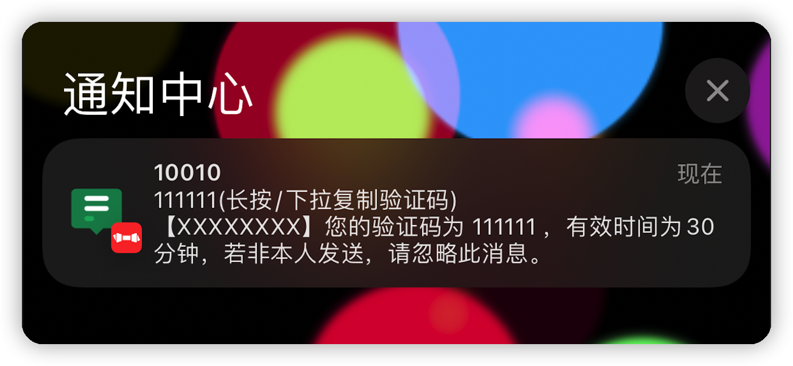</td>
    <td valign="top">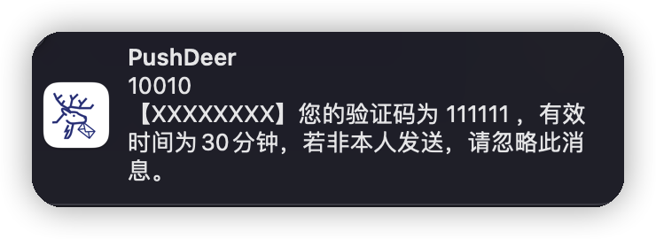</td>
  </tr>
  <tr>
    <td valign="top">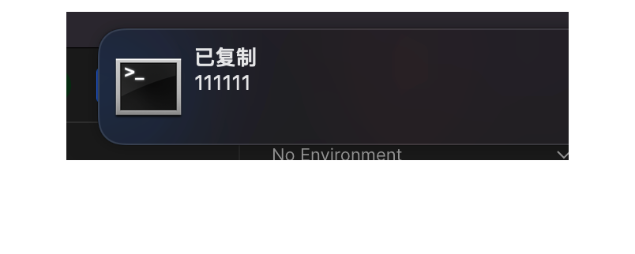</td>
    <td valign="top">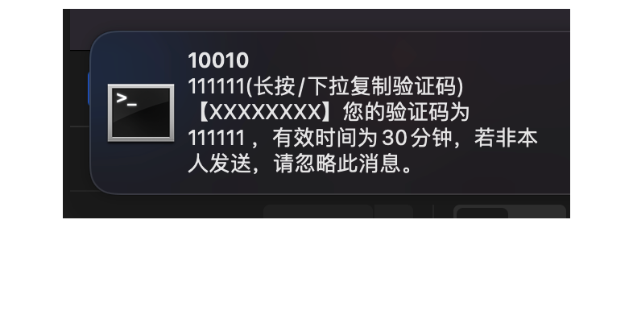</td>
  </tr>
  
</table>

自动复制验证码

> 不设置自动复制的参数 autoCopy 或 超过最大允许长度 或 剪贴板无变化时, 不自动复制, 此时可点击复制按钮 手动复制

## 安装/设置 `腾讯手机管家` 和 `360手机卫士`

> 提醒 原理上来说只有发请求查询的才有可能进脚本处理...某些号码的短信本身就不会触发请求查询 所以也不可能被转发

1. 安装后按 app 提示开启短信骚扰拦截.

2. 如下图开启 `精准查询`(腾讯手机管家) / `智能云端引擎精准过滤`(360 手机卫士)

3. 在系统设置里, 将`未知与过滤信息` 设为对应的 app

<table>
  <tr>
    <td valign="top">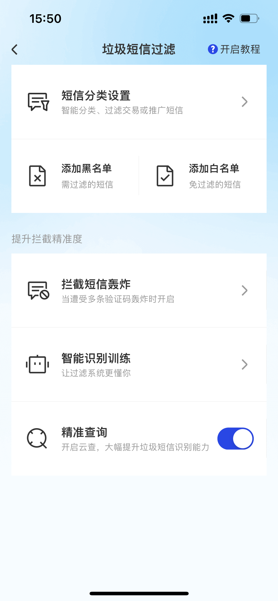</td>
    <td valign="top">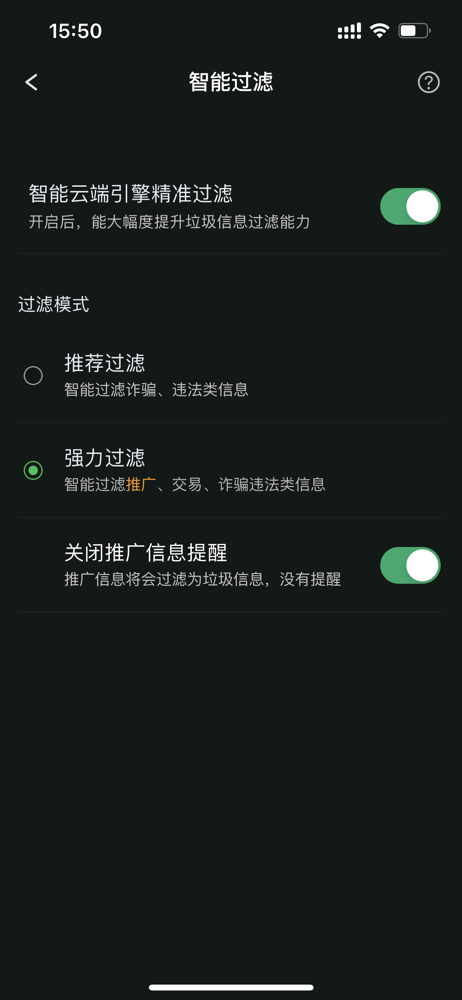</td>
    <td valign="top">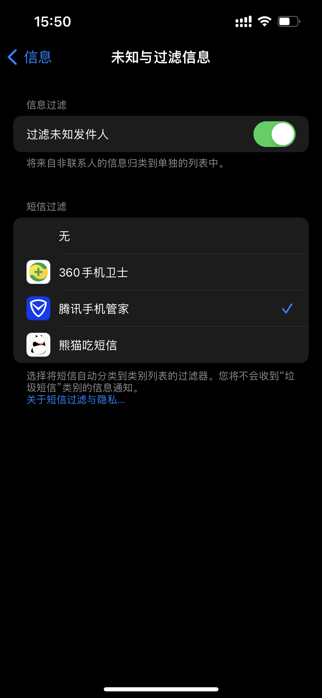</td>
  </tr>
 </table>

## 直接使用 Surge 模块

[https://raw.githubusercontent.com/ChinaTelecomOperators/SMSForward/main/sms-forward.sgmodule](https://raw.githubusercontent.com/ChinaTelecomOperators/SMSForward/main/sms-forward.sgmodule)

`Shadowrocket` 也支持 使用类似 `Surge`

## Stash 使用覆写

[https://raw.githubusercontent.com/ChinaTelecomOperators/SMSForward/main/sms-forward.stash.stoverride](https://raw.githubusercontent.com/ChinaTelecomOperators/SMSForward/main/sms-forward.stash.stoverride)

## Loon 使用插件

[https://raw.githubusercontent.com/ChinaTelecomOperators/SMSForward/main/sms-forward.loon.plugin](https://raw.githubusercontent.com/ChinaTelecomOperators/SMSForward/main/sms-forward.loon.plugin)

## 其他客户端的配置请自行参考对应的配置方式

## BoxJs

使用 [BoxJs 测试版](https://chavyleung.gitbook.io/boxjs) 添加 订阅 [https://raw.githubusercontent.com/ChinaTelecomOperators/SMSForward/main/boxjs.json](https://raw.githubusercontent.com/ChinaTelecomOperators/SMSForward/main/boxjs.json)

## 配置

基本上打开 BoxJs 都能看明白

### 通知模板

通知标题模板

> 默认: [号码], 例: 10010

通知副标题模板

> 默认: [码][复制提示], 例: 123456(长按/下拉复制验证码)

通知正文模板

> 默认: [内容], 例: 您的验证码为 123456

### 使用 PushDeer/PushPlus 等服务

1. 假设你 PushDeer 的链接为 `https://api2.pushdeer.com/message/push?pushkey=XXXXXXXXXXX` 你的 key 为 `XXXXXXXXX`

可在 BoxJs 里设置 `PushDeer/PushPlus 等` 为 `https://api2.pushdeer.com/message/push?pushkey=XXXXXXXXXXX&text=[推送全文]`

2. 假设你 PushPlus 的链接为 `http://www.pushplus.plus/send?token=XXXXXXXXX&content=[推送全文]&channel=wechat` 你的 key 为 `XXXXXXXXX`

其他参数可查看官方文档 [PushPlus 发送消息接口](http://www.pushplus.plus/doc/guide/api.html#%E4%B8%80%E3%80%81%E5%8F%91%E9%80%81%E6%B6%88%E6%81%AF%E6%8E%A5%E5%8F%A3)

例如 上述链接中的 `wechat` 改为 `mail` 即可实现邮件转发.

可在 BoxJs 里设置 `PushDeer/PushPlus 等` 为 `http://www.pushplus.plus/send?token=XXXXXXXXX&content=[推送全文]&channel=wechat`

`[推送全文]` 会被自动替换

> 聪明的你一定能看懂吧

其实不管什么服务 只要是 get 请求就可以支持. 只要在对应的参数留好 `[推送全文]`

但是可能不同的服务返回值不同 如果发现有实际成功但是提示未知错误的 可以发日志给我

### 使用 Bark 等服务

使用 Bark 通知 可实现更多通知效果: 推送铃声, 推送图标, 时效性通知, 复制推送内容等. 具体功能请参考 Bark 的设置说明.

假设你 Bark 的链接为 `https://api.day.app/XXXXXXXXX/` 你的 key 为 `XXXXXXXXX`

可在 BoxJs 里设置 `Bark/自建服务端等` 为 `https://api.day.app/XXXXXXXXX/[推送标题]/[推送内容]?group=sms&autoCopy=1&isArchive=1&icon=https%3A%2F%2Fraw.githubusercontent.com%2FChinaTelecomOperators%2Fscripts%2Fmain%2Fsurge%2Fmodules%2Fsms-forward%2Fasset%2F1.png&copy=[复制内容]&sound=shake&level=timeSensitive`

`[推送标题]` `[推送内容]` `[复制内容]` 会被自动替换. 其他参数请参考 Bark 的设置说明.

> 聪明的你一定能看懂吧

其实不管什么服务 只要是 get 请求就可以支持. 只要在对应的参数留好 `[推送标题]` `[推送内容]` `[复制内容]`

但是可能不同的服务返回值不同 如果发现有实际成功但是提示未知错误的 可以发日志给我

### 使用自建服务端和客户端进行通知转发

#### 服务端

`https://github.com/ChinaTelecomOperators/SMSForward/tree/main/server`

```
pnpm i
mv .env-sample .env
```

编辑 `.env` 设置 token 等参数

```
pnpm start
```

请求参数:

`autoCopy` 是否自动复制

`copy` 复制的内容

其他参数 参考 `https://www.npmjs.com/package/node-notifier` 文档

例如 `contentImage` 附加图片的本地路径(指的是下面的客户端运行的环境)

`sound` 通知声音 等等

可在 BoxJs 里设置 `Bark/自建服务端等` 为 `http://服务器IP:服务器端口/你设置的token/[推送标题]/[推送内容]?autoCopy=1&copy=[复制内容]&sound=true&contentImage=%2FUsers%2Ffoo%2FDropbox%2Fpics%2Favatar%2Favatar_large.png`

自建域名转发等等不再赘述

#### 客户端

<table>
  <tr>
    <td valign="top"></td>
    <td valign="top">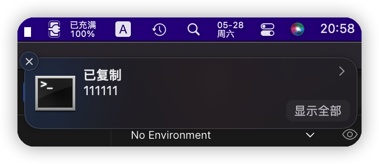</td>
  </tr>
  <tr>
    <td valign="top"></td>
    <td valign="top">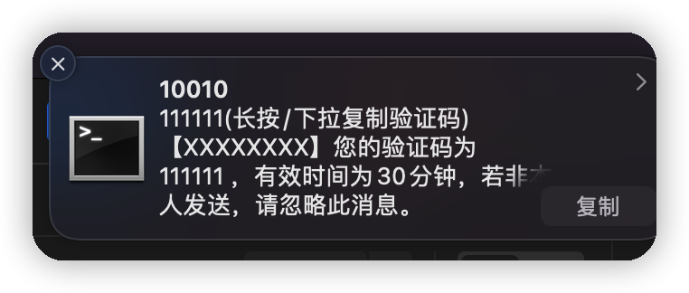</td>
  </tr>
</table>

`https://github.com/ChinaTelecomOperators/SMSForward/tree/main/server`

```
pnpm i
mv .env-sample .env
```

编辑 `.env` 设置 `服务器`, `自动复制内容最大长度` 等参数

```
pnpm start
```

## 同时使用多套配置

### 以两套配置为例

为方便同时配置和使用多套配置, BoxJs 配置中预置了第二套配置 `sms_forward-1`.

1. 在主配置 `短信转发(ChinaTelecomOperators.sms_forward)` 里完成设置. 将 `其他配置的 key(英文逗号,分隔)` 这一项设置为 `sms_forward-1`.
2. 在第二套配置 `短信转发(1)(ChinaTelecomOperators.sms_forward-1)` 里完成设置.
3. 此时脚本执行时将依次处理主配置和第二套配置.

<table>
  <tr>
    <td valign="top">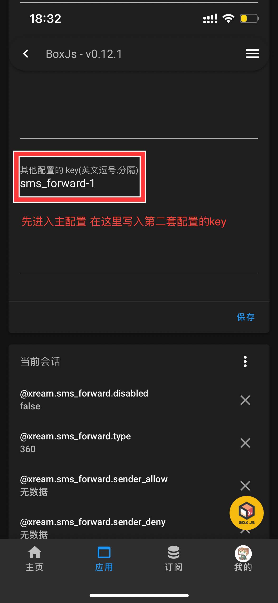</td>
    <td valign="top"></td>
    <td valign="top">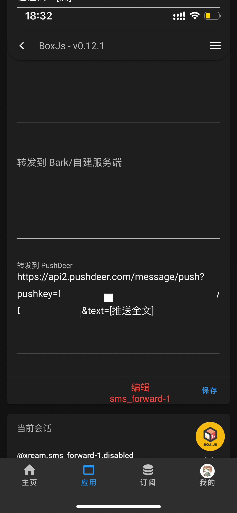</td>
  </tr>
</table>

### 更多的配置 以四套配置为例

复制 默认的 BoxJs 订阅. 自己维护 第二套配置 `短信转发(1)(ChinaTelecomOperators.sms_forward-1)`, 第三套配置 `短信转发(2)(ChinaTelecomOperators.sms_forward-2)`, 第四套配置 `短信转发(3)(ChinaTelecomOperators.sms_forward-3)` 的数据结构.

<table>
  <tr>
    <td valign="top">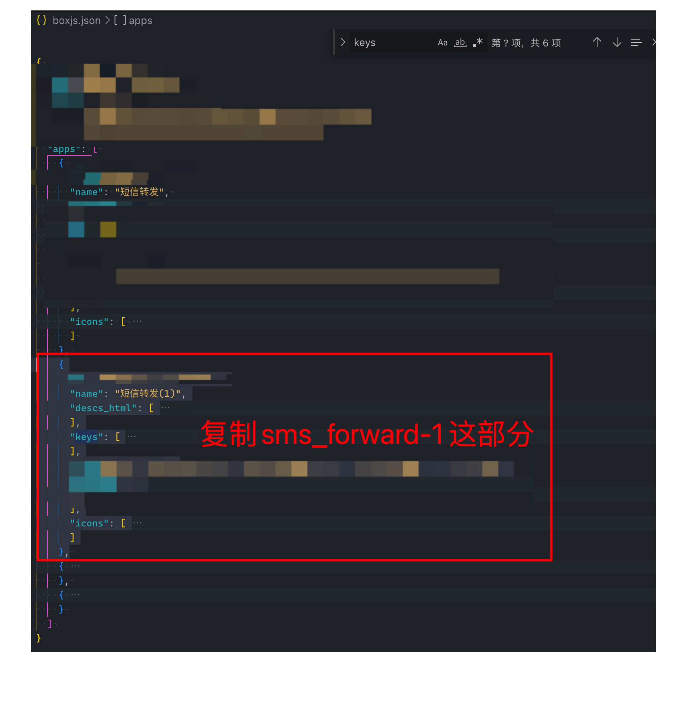</td>
    <td valign="top">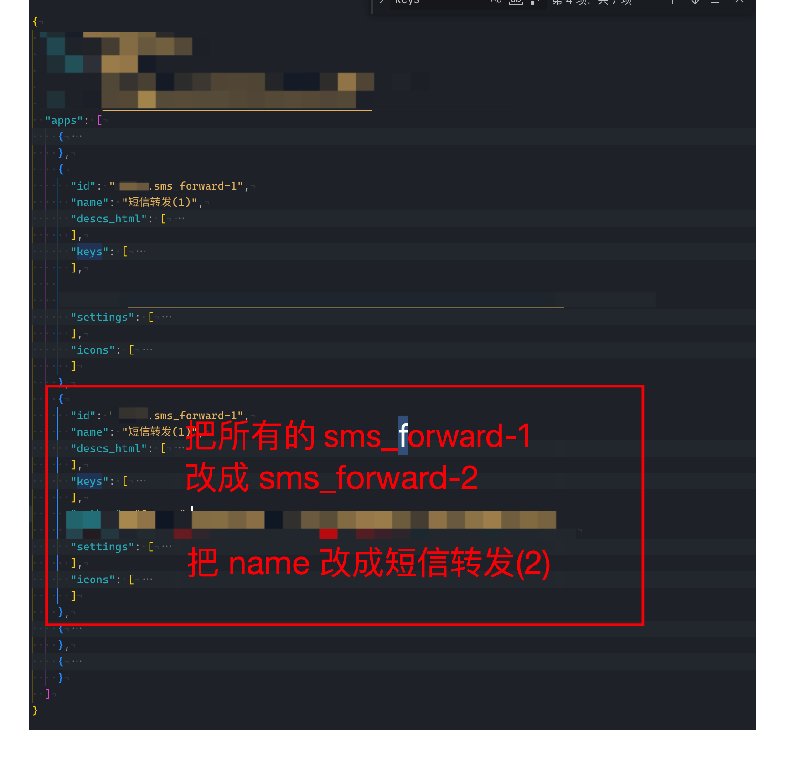</td>
    <td valign="top">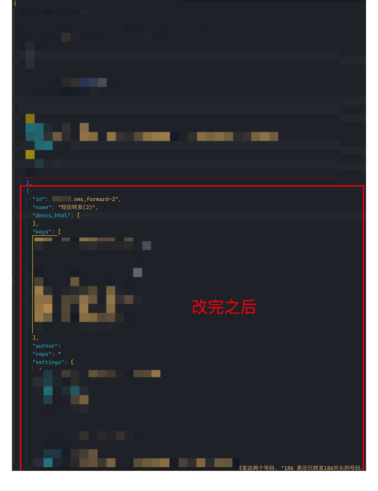</td>
  </tr>
</table>

1. 在主配置 `短信转发(ChinaTelecomOperators.sms_forward)` 里完成设置. 将 `其他配置的 key(英文逗号,分隔)` 这一项设置为 `sms_forward-1, sms_forward-2, sms_forward-3`.
2. 在第二套配置 `短信转发(1)(ChinaTelecomOperators.sms_forward-1)` 里完成设置.
3. 在第三套配置 `短信转发(2)(ChinaTelecomOperators.sms_forward-2)` 里完成设置.
4. 在第四套配置 `短信转发(3)(ChinaTelecomOperators.sms_forward-3)` 里完成设置.
5. 此时脚本执行时将依次处理主配置, 第二套配置, 第三套配置, 第四套配置.
